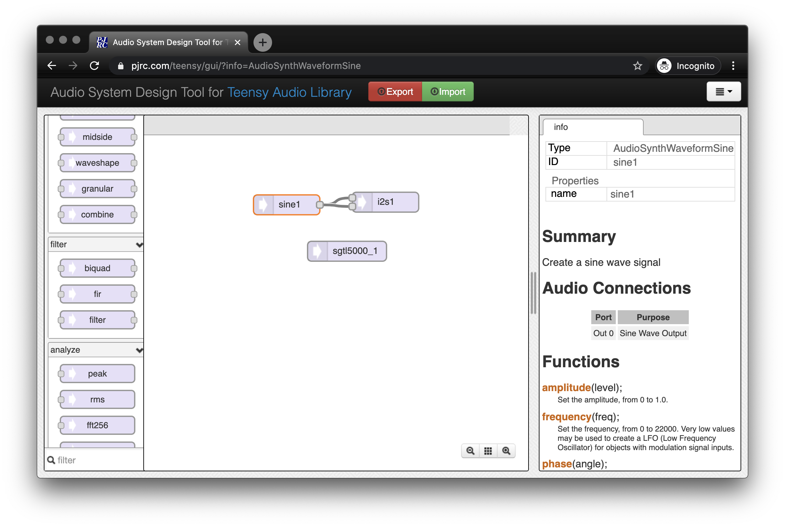

Working With The Teensy Audio Library
=====================================

IDE 
---
 
Teensy provides a forked version of the Arduino environment that contains all of the board files and examples for the Teensy environment and the audio library.  

https://www.pjrc.com/teensy/teensyduino.html - Description Page 

https://www.pjrc.com/teensy/td_download.html - Download Page 

 

Audio Library GUI Tool 
----------------------
Teensy provides a visual tool for creating patches of the audio components in the audio library. The visual tool also provides inline documentation of the individual units.  

Sensors to Sine Waves
=====================

1. Start by using the GUI tool to create the following diagram. This diagram connects a different sine wave generator to the left and right channels of the teensy audio shield. The SGTL5000 is the control chip for the audio shield, we will issues some commands to it in order to turn the audio on for our finished sketch. 

2. Click the EXPORT button on the top of the page. Copy the resulting the code and paste it into a new sketch in Teensyduino.

It will generate some code like the following. You will find some small differences in the comments depending on the positions of the objects in your sketch. 

    #include <Audio.h> 
    #include <Wire.h> 
    #include <SPI.h> 
    #include <SD.h> 
    #include <SerialFlash.h> 

    // GUItool: begin automatically generated code 
    AudioSynthWaveformSine   sine1;          //xy=279,246 
    AudioOutputI2S           i2s1;           //xy=428,242 
    AudioConnection          patchCord1(sine1, 0, i2s1, 0); 
    AudioConnection          patchCord2(sine1, 0, i2s1, 1); 
    AudioControlSGTL5000     sgtl5000_1;     //xy=546,430 
    // GUItool: end automatically generated code 

3. We will add some code to the template. Your blank sketch will start with a 

    #include <Audio.h> 
    #include <Wire.h> 
    #include <SPI.h> 
    #include <SD.h> 
    #include <SerialFlash.h> 

    // GUItool: begin automatically generated code 
    AudioSynthWaveformSine   sine1;          //xy=279,246 
    AudioOutputI2S           i2s1;           //xy=428,242 
    AudioConnection          patchCord1(sine1, 0, i2s1, 0); 
    AudioConnection          patchCord2(sine1, 0, i2s1, 1); 
    AudioControlSGTL5000     sgtl5000_1;     //xy=546,430 
    // GUItool: end automatically generated code 

    void setup() { 

    // set up the audio shield 
    AudioNoInterrupts(); // turn off interrupts to the audio layer to allow setting changes 
    sgtl5000_1.enable(); // enables the audio chip 
    sgtl5000_1.volume(0.3); // turns  the volume down 

    // raise this number gradually to increase the volume 
    sgtl5000_1.lineInLevel(0,0); // turns off the linein on the side of the shield 

    /// set up the sound generators here 
    sine1.amplitude( .5 );  
    sine1.frequency( 500  ); 

    AudioMemory(20); 
    AudioInterrupts(); // turn on the audio interrupts 
    } 

    void loop() { 
    int sensor1val = analogRead( A0 ); 
    int sensor2val = analogRead( A1 ); 

    float scaledvalue1 = (float)sensor1val / 1024.0; 
    float scaledvalue2 = (float)sensor2val / 4.0; 
    sine1.amplitude( scaled1val ); 
    sine1.frequency( scaled2val ); 
    } 